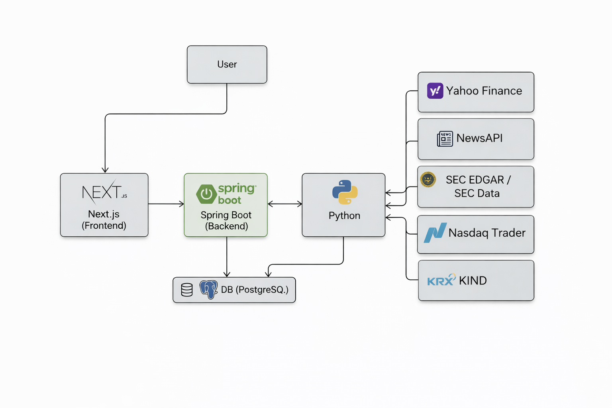
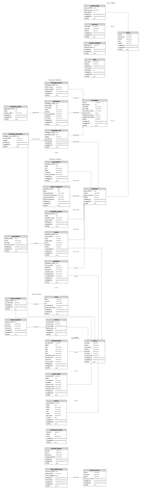

# Quant

  
  
  
  
  
  

  여러 투자 규칙을 조합해 전략을 만들고, 과거 성과를 검증한 뒤, 실제 운용과 위험 관리까지 이어서 확인할 수 있는 규칙 기반 퀀트 투자 플랫폼

- 여러 투자 지표를 조합한 전략 설계와 후보 종목 선별
- 백테스트 결과, 거래 로그, 매매 신호 시점, 패턴별 성과 분석
- 후보 종목과 매매 규칙을 다시 검증하고 비교하는 실험 화면 제공
- 전략 실행, 포트폴리오, 주문, 리스크, 데이터 운영 관리

일반적인 사용 흐름:

`시장 상황 확인 -> 조건에 맞는 종목 찾기 -> 전략 만들기 -> 과거 성과 검증 -> 매매 규칙 실험 -> 전략 저장 -> 전략 실행 -> 포트폴리오 및 리스크 관리`

## Structure

1. 사용자는 `Next.js` 화면으로 들어와 전략 생성, 백테스트, 리스크 확인 같은 작업을 수행합니다.
2. 화면에서 발생한 요청은 `Spring Boot`가 받아 전략, 포트폴리오, 주문, 작업 상태 같은 플랫폼 로직을 처리합니다.
3. 주식 데이터 분석, 후보 종목 계산, 백테스트, 최적화처럼 계산량이 큰 작업은 `Spring Boot`가 `Python` 쪽에 요청하고 결과를 다시 받아 사용자에게 전달합니다.
4. 계산 결과와 플랫폼 데이터는 `PostgreSQL`에 저장되고, 이후 화면과 이력 조회에 다시 사용됩니다.

## 외부 API 및 데이터 소스

호출 흐름은 다음과 같습니다.

`Next.js -> Spring Boot -> Python Quant Engine -> 외부 데이터 소스`

- `Next.js` 프론트엔드는 외부 3rd-party API를 직접 호출하지 않습니다.
- `Spring Boot`는 외부 공개 API 대신 내부 `Python Quant Engine`을 호출합니다.
- 실제 외부 데이터 수집은 주로 `Python Quant Engine`에서 수행합니다.

### 1. Yahoo Finance 데이터 소스

가장 넓게 사용되는 시세/메타데이터 공급원입니다.

- 사용 목적
  - 종목 가격 이력 다운로드
  - 시장 지수 조회
  - 심볼 검색
  - 종목 프로필 및 보조 펀더멘털 조회
  - 실적 일정 조회
  - insider 거래 조회
- 사용 기능
  - 시장 현황
  - 종목 검색 및 종목 등록
  - 데이터 센터 적재
  - 백테스트용 가격 데이터 준비
  - 벤치마크 시계열 보강
  - 이벤트 분석
- 인증
  - 현재 코드 기준 별도 API Key 설정 없음
- 비고
  - 코드에서는 Yahoo Finance 관련 데이터 공급자를 통해 시세, 검색, 이벤트 데이터를 수집합니다.

### 2. NewsAPI

뉴스 분석 및 뉴스 영향도 기능에서 사용하는 외부 뉴스 공급자입니다.

- 기본 엔드포인트
  - `https://newsapi.org/v2/everything`
- 사용 목적
  - 종목 또는 키워드 기준 최신 뉴스 수집
  - 뉴스 감성 분석 입력 데이터 확보
  - 뉴스 영향도 그래프 생성용 원문 데이터 수집
- 사용 기능
  - News Intelligence
  - Event Analysis 일부 뉴스 연계 기능
- 인증
  - `NEWS_API_KEY` 필요
- 비고
  - API 키가 없으면 캐시된 뉴스만 사용하고, 캐시도 없으면 외부 의존성 오류를 반환합니다.

### 3. SEC EDGAR / SEC Data

미국 상장 종목의 회사 프로필과 공시 기반 펀더멘털 데이터를 수집하는 데 사용합니다.

- 사용 엔드포인트
  - `https://www.sec.gov/files/company_tickers_exchange.json`
  - `https://www.sec.gov/Archives/edgar/daily-index/xbrl/companyfacts.zip`
  - `https://data.sec.gov/submissions/CIK{cik}.json`
- 사용 목적
  - 미국 종목 ticker-CIK 매핑 확보
  - 회사 기본 프로필 보강
  - 공시 기반 매출, 순이익, EPS, 자본총계 등 펀더멘털 계산
- 사용 기능
  - 종목 등록 시 미국 종목 메타데이터 보강
  - 데이터 센터 펀더멘털 적재
  - 종목 상세 화면의 재무 지표 보강
- 인증
  - 별도 API Key는 없지만 `SEC_USER_AGENT` 설정을 사용
- 비고
  - 다운로드 결과는 `.cache/sec` 아래에 캐시합니다.

### 4. Nasdaq Trader Symbol Directory

미국 상장 종목 유니버스 구성을 위해 사용합니다.

- 사용 엔드포인트
  - `https://www.nasdaqtrader.com/dynamic/SymDir/nasdaqlisted.txt`
  - `https://www.nasdaqtrader.com/dynamic/SymDir/otherlisted.txt`
- 사용 목적
  - NASDAQ, NYSE, NYSE Arca, IEX, BATS 등 미국 상장 종목 마스터 목록 수집
- 사용 기능
  - 전체 종목 유니버스 탐색
  - 데이터 동기화 시 종목 마스터 초기 구성
- 인증
  - 별도 인증 없음

### 5. KRX KIND

국내 상장 종목 유니버스 구성을 위해 사용합니다.

- 사용 엔드포인트
  - `https://kind.krx.co.kr/corpgeneral/corpList.do?method=download&searchType=13&marketType=stockMkt`
  - `https://kind.krx.co.kr/corpgeneral/corpList.do?method=download&searchType=13&marketType=kosdaqMkt`
- 사용 목적
  - KOSPI, KOSDAQ 상장 종목 목록 수집
  - 국내 종목명, 업종, 시장 구분 기초 데이터 확보
- 사용 기능
  - 국내 종목 마스터 구성
  - 종목 검색 보조
  - 데이터 센터 적재
- 인증
  - 별도 인증 없음

### 요약

현재 프로젝트에서 코드상 직접 확인되는 외부 API/데이터 소스는 아래 5개입니다.

1. Yahoo Finance 데이터 소스
2. NewsAPI
3. SEC EDGAR / SEC Data
4. Nasdaq Trader Symbol Directory
5. KRX KIND

## 오래 걸리는 작업 처리

백테스트나 데이터 동기화처럼 오래 걸리는 작업은 화면 요청을 붙잡아두지 않고 백그라운드에서 실행합니다.

1. Python 쪽에서는 `ThreadPoolExecutor` 기반 스레드 방식으로 백그라운드 작업을 실행합니다.
2. 작업이 등록되면 `jobId`가 발급되고, `jobs` 테이블에 `PENDING`, `RUNNING`, `COMPLETED`, `FAILED` 상태가 저장됩니다.
3. 작업 진행 중에는 `progressPercent`, `stage`, `stageLabel`, `message`, `processedCount`, `totalCount` 같은 진행 정보가 함께 기록됩니다.
4. 백테스트가 끝나면 완료 상태와 함께 `backtestId`, 주요 성과 지표, 최근 편입 종목 수 같은 결과 요약도 메타데이터에 저장됩니다.
5. 화면에서는 이 `jobId`를 이용해 진행 상태를 다시 조회할 수 있게 했습니다.

사용자가 진행중 또는 완료 상태를 확인하는 방식:
- 클라이언트에서 풀링 방식으로 주기적으로 조회합니다.

## ERD

1. `users`, `portfolio`, `activity_logs`는 사용자와 운용 활동의 기본 축입니다.
2. `stocks`는 가격, 재무, 팩터, 포지션, 주문, 뉴스, 이벤트가 연결되는 중심 마스터 테이블 역할을 합니다.
3. `strategies`, `strategy_factors`, `backtests`, `backtest_equity`, `strategy_runs`, `strategy_allocations`는 전략 설계, 검증, 실행 라이프사이클을 구성합니다.
4. `portfolio`, `positions`, `orders`, `executions`, `risk_metrics`, `factor_exposure`는 실제 운용과 리스크 점검을 담당합니다.
5. `news`, `events`, `event_analysis`, `data_sources`, `data_update_log`는 대체 데이터와 운영 파이프라인 상태를 추적하는 영역입니다.

## AI / NLP 활용

Hugging Face를 통해 AI 라이브러리를 실제 기능에 사용하고 있습니다.  
`transformers`와 `torch`를 이용해 뉴스 감성 분석과 영한 번역을 처리합니다.

### 사용 라이브러리와 모델

- `transformers`
  - Hugging Face pipeline 기반 추론 인터페이스
- `torch`
  - `transformers` 모델 추론 런타임
- `ProsusAI/finbert`
  - 금융 뉴스 감성 분석 모델
- `Helsinki-NLP/opus-mt-tc-big-en-ko`
  - 영어 뉴스를 한국어로 번역하는 모델

### 왜 사용했는가

- `ProsusAI/finbert`
  - 일반 감성 모델보다 금융 문맥에 특화되어 `beat`, `miss`, `downgrade`, `guidance`, `surge` 같은 시장 언어를 더 안정적으로 해석할 수 있기 때문입니다.
  - 뉴스 분석 화면과 이벤트 분석 화면에서 종목 관련 뉴스의 긍정/부정 강도를 점수화해 `news_score`와 영향도 계산에 활용하기 좋습니다.
- `Helsinki-NLP/opus-mt-tc-big-en-ko`
  - 해외 뉴스 원문이 영어인 경우가 많아, 한국어 사용자 기준에서 제목과 요약을 바로 읽을 수 있게 하기 위해 사용했습니다.
  - 해외 뉴스 인입 후 한국어 UI에서 바로 해석 가능하도록 번역 품질과 적용 편의성이 좋습니다.
- `transformers` pipeline
  - 모델 교체가 쉽고, 서비스 코드에서 감성 분석과 번역을 단순한 추론 호출로 통일할 수 있어 유지보수에 유리합니다.
- `torch`
  - Hugging Face 모델 실행 기반이 필요하므로 함께 사용합니다.

## Python Quant Engine으로 퀀트 기법 활용

Spring Boot는 화면과 서비스 흐름을 연결하고, 실제 정량 계산은 Python 엔진이 맡습니다.  
사용자는 복잡한 계산 과정을 직접 다루지 않아도 되고, 플랫폼 안에서 전략 설계부터 검증, 비교, 운용 점검까지 한 흐름으로 확인할 수 있습니다.

### 1. 후보 종목 선별

Python 엔진은 여러 투자 지표를 함께 비교해 종목 후보를 고릅니다.

- 수익성, 저평가 여부, 성장성, 거래량, 최근 주가 흐름, 뉴스 영향 등을 함께 반영합니다.
- 지표마다 단위가 달라도 같은 기준으로 맞춘 뒤 종합 점수를 계산합니다.
- 한두 가지 조건만 보는 것이 아니라 여러 기준을 함께 반영해 우선순위를 정합니다.

즉, 특정 지표 하나만 보고 종목을 고르는 것이 아니라,  
여러 조건을 종합해 더 일관된 방식으로 투자 후보를 추리는 구조입니다.

### 2. 백테스트와 패턴 검증

이 프로젝트는 전략을 과거 데이터에 적용해 결과를 검증합니다.

- 수익률뿐 아니라 최대 손실 구간, 변동성, 승률, 위험 대비 성과를 함께 확인합니다.
- 거래비용과 실제 매매 과정에서 생길 수 있는 오차까지 고려합니다.
- 리밸런싱 기록, 종목별 성과, 거래 내역, 매매 신호 시점을 함께 제공합니다.
- 진입가, 손절가, 목표가 같은 가격 계획도 함께 검토할 수 있습니다.

패턴 검증도 감에 의존하지 않습니다.  
돌파 폭, 거래량 변화, 추세 강도처럼 숫자로 표현할 수 있는 조건을 기준으로 같은 규칙을 반복 검증할 수 있게 구성했습니다.

### 3. 뉴스와 이벤트 해석

이 프로젝트는 뉴스를 단순 참고 자료로만 두지 않고 투자 판단에 활용할 수 있는 정보로 바꿉니다.

- 금융 뉴스의 분위기를 긍정, 부정, 중립 흐름으로 나눠 분석합니다.
- 해외 뉴스를 한국어로 이해하기 쉽게 정리합니다.
- 뉴스가 특정 종목에 미치는 영향을 점수 형태로 반영합니다.
- 이벤트 흐름을 전략 검토와 종목 분석에 연결할 수 있습니다.

즉, 뉴스도 읽고 끝나는 정보가 아니라  
전략 판단에 참고할 수 있는 정량 신호로 연결하는 방향을 지향합니다.

### 4. 전략 조정과 재검증

이 프로젝트는 전략 조건을 조금씩 바꿔가며 어떤 설정이 더 안정적인지 비교할 수 있게 설계했습니다.

- 조건 변화에 따라 성과가 어떻게 달라지는지 확인할 수 있습니다.
- 한 시점의 좋은 결과만 믿지 않도록 기간을 나눠 다시 검증할 수 있습니다.
- 과하게 맞춘 전략이 아닌지 점검하는 데 도움이 됩니다.

즉, 겉으로 좋아 보이는 결과 하나를 고르는 것이 아니라,  
다른 기간에서도 비슷하게 작동하는지 확인하는 검증 과정을 중요하게 봅니다.

### 5. 리스크 관리와 확장성

이 프로젝트는 수익률만 강조하지 않고 손실 가능성과 시장 위험도 함께 봅니다.

- 가격 흔들림, 최대 손실 구간, 시장과의 연관성 같은 위험 지표를 함께 확인합니다.
- 전략별 위험 수준을 비교해 무리한 운용을 줄일 수 있게 돕습니다.
- 앞으로는 금리, 물가, 변동성 지수 같은 거시경제 변수도 보조 신호로 연결할 수 있는 구조입니다.

즉, 이 프로젝트는 종목 선별, 백테스트, 뉴스 해석, 전략 재검증, 리스크 관리를  
하나의 흐름으로 이어서 다루는 규칙 기반 퀀트 투자 플랫폼입니다.

## 주요 기능

- [x] 대시보드와 시장 현황 화면에서 시장 및 플랫폼 상태 확인
- [x] 종목 찾기와 종목 분석 화면에서 조건 검색과 종목 조회
- [x] 전략 만들기 화면에서 투자 대상 범위, 선별 조건, 지표 비중, 리밸런싱 설정
- [x] 후보 종목 분석과 전략 요약 저장
- [x] 백테스트 결과, 최대 손실 구간, 종목별 성과, 거래 내역, 매매 신호 시점 제공
- [x] 패턴 실험 화면에서 매수, 매도, 관망 신호와 가격 계획 검토
- [x] 전략 보관함, 전략 비교, 전략 최적화 기능 제공
- [x] 전략 실행 관리와 주문 관리 화면에서 실행 모니터링
- [x] 포트폴리오와 리스크 관리 화면에서 운용 및 리스크 점검
- [x] 데이터 관리와 작업 현황 화면에서 데이터 적재와 작업 상태 추적
- [x] 뉴스 분석과 이벤트 분석 화면에서 뉴스, 감성, 이벤트 분석
- 
